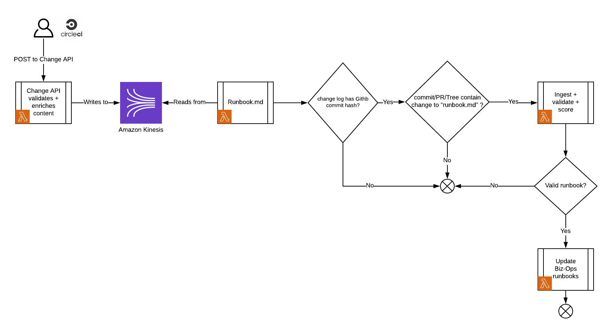

# runbook.md

runbook.md is a toolchain used for improving the quality of runbooks across the business, and ensuring consistency of the information contained within runbooks with [biz-ops](https://biz-ops.in.ft.com/) – the knowledge base which models our business operations.

Talk to us in [#runbooks-in-repos](https://financialtimes.slack.com/messages/CFR0GPCAH) on Slack if you have any further questions.

## Toolchain

### Automated ingestion on publishing of release logs

All systems which integrate with [Change API](https://github.com/Financial-Times/change-api#change-api---v2) benefit from automated `runbook.md` ingestion and synchronisation with [biz-ops](https://biz-ops.in.ft.com/), on every release that contains changes to a `runbook.md` file.

Please add Change API to your deployment pipeline and release your code.
A successful journey will see any `runbook.md` file changes automatically applied in Biz Ops to the relevant system(s).

Here is the workflow: 

### GitHub app (alpha)

The [runbook.md github app](https://github.com/organizations/Financial-Times/settings/installations/1210233) validates a repository's RUNBOOK.MD files against our organisation-wide standard, and offers suggestions for improvement.

**This application is alpha. Please AVOID installing it on all repositories. If you would like to test-drive it, add your repo to the repository access list [here](https://github.com/organizations/Financial-Times/settings/installations/1210233).**


### Manual update

This utility allows manual upload of a RUNBOOK.md file for validation and [operability scoring](https://github.com/Financial-Times/system-operability-score). Optionally, the tool can be used to populate associated critical fields in Biz Ops based on the content of a _valid runbook_.

See an example of the format/content of a RUNBOOK.md file [here](./docs/example.md).

## System (business logic) overview


## Installation and development

### Prerequisites

-   Ensure [Docker](https://docs.docker.com/) is installed and running
-   Ensure AWS CLI tooling is installed https://docs.aws.amazon.com/cli/latest/userguide/cli-chap-install.html

Using [GNU Make](https://www.gnu.org/software/make/) as a task runner:

-   `make install` installs dependencies and add linting config files
-   `make env` populates an `.env` file with the appropriate environment variables from Vault
-   `make run` runs the app which you can then visit at http://localhost:3000/runbook.md
-   `make test` runs tests
-   `make verify` runs linter checks (with eslint, using prettier)

### Emulating Change API's release log message stream, offline

The task `make run-local-message-stream` sets up and starts an [offline emulation of AWS' Kinesis](https://github.com/mhart/kinesalite). You can put records onto the resulting stream – `change-request-api-test-enriched-stream` – using the following AWS CLI command.

```bash
aws kinesis --endpoint-url http://localhost:4567 \
   put-record --stream-name change-request-api-test-enriched-stream \
   --partition-key “MyFirstMessage” \
   --data [stringifiedJSONreleaseLog](https://github.com/Financial-Times/runbook.md/blob/master/docs/change-api-example-message.json)
```

### Troubleshooting common issues

The following error can occur when trying try to execute `make run`:

```js
{
   errno: 'ENOTFOUND',
   code: 'ENOTFOUND',
   syscall: 'getaddrinfo',
   hostname: 'local.in.ft.com'
}
```

In this case, check your `/etc/hosts` file and add the entry: `127.0.0.1 local.in.ft.com`.
